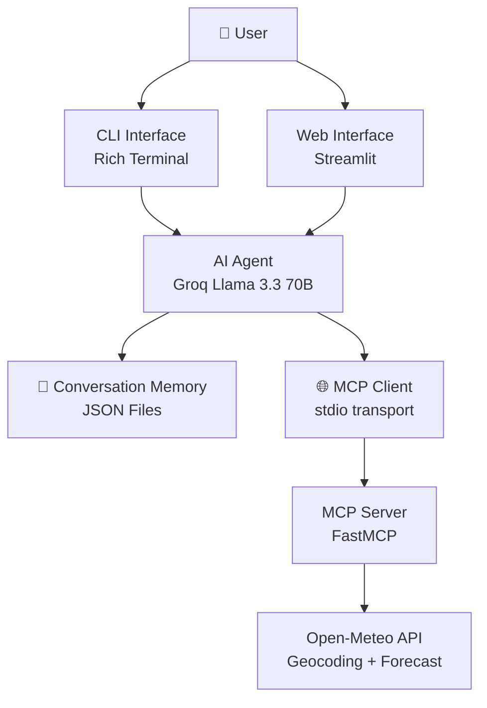

# 🌦️ Weather MCP Server + AI Agent

An intelligent weather assistant powered by **Groq LLM** + **MCP Server** that understands natural language queries in any language, fetches real-time weather data from **Open-Meteo**, and responds conversationally.

[]()
[]()
[]()
[]()

## ✨ Features

- **🌍 Multi-language** — Ask in English, Urdu, Roman Urdu, or any language — auto-detected
- **☀️ Real weather data** — Powered by Open-Meteo (free, no API key needed)
- **🤖 LLM-powered** — Groq's Llama 3.3 70B for intelligent, conversational responses
- **🛠️ MCP Protocol** — Standardized tool calling via Model Context Protocol
- **💾 Conversation memory** — JSON-based persistence across sessions
- **🖥️ Two interfaces** — Beautiful CLI (Rich) and Web UI (Streamlit)
- **🔌 Extensible** — Easy to add more MCP tools

## 🏗️ Architecture



## 📋 Prerequisites

- **Python 3.10+** (3.11+ recommended)
- **uv** — Fast Python package manager (recommended)
- **Groq API key** — Free at https://console.groq.com/keys

## 🚀 Installation

```bash
# Clone the repository
git clone <repo-url>
cd weather-mcp-agent

# Install dependencies with uv (recommended)
uv sync

# Or with pip
pip install -r requirements.txt
```

### Setting up your API key

Create a `.env` file in the project root:

```bash
echo GROQ_API_KEY=your_groq_api_key_here > .env
```

Get a free API key from [Groq Console](https://console.groq.com/keys).

## 🎮 Usage

### CLI Interface

Run the terminal chatbot:

```bash
python -m src.cli.main
```

**CLI commands:**
| Command | Action |
|---------|--------|
| `/quit` | Exit the application |
| `/clear` | Clear conversation history |
| `/history` | Show past messages |

**Example:**
```
🌦️  Weather AI Assistant
Ask me about weather anywhere in the world. I detect your language automatically!

You: What's the weather in Tokyo?
Assistant: ☁️ Tokyo is currently overcast at 16.7°C (feels like 17.0°C).
Humidity is 80% with a gentle breeze from the northeast.

You: Lahore ka mausam kaisa hai?
Assistant: ☀️ Lahore mein aaj mausam saaf hai! Taapmaan 35.2°C hai...
```

### Web Interface

Run the Streamlit chat app:

```bash
streamlit run src/web/app.py
```

Open http://localhost:8501 in your browser.

- **Sidebar** — Session management (new/switch/clear conversations)
- **Chat input** — Type naturally in any language
- **Auto language detection** — Responses match your language

### MCP Server (Standalone)

Run the MCP server independently for use with other MCP clients:

```bash
python -m src.mcp_server.server

# Or with MCP Inspector for testing:
mcp dev src/mcp_server/server.py
```

## 🛠️ API Reference

### MCP Tools

| Tool | Parameters | Description |
|------|-----------|-------------|
| `get_current_weather` | `city: string` (required) | Current temperature, humidity, wind, conditions |
| `get_weather_forecast` | `city: string` (required), `days: int` (optional, 1-7, default 3) | Multi-day forecast with highs/lows |

### Weather Agent

```python
from src.agent.agent import WeatherAgent

async with WeatherAgent() as agent:
    response = await agent.chat("session-id", "What's the weather in London?")
    print(response)
```

### Conversation Memory

```python
from src.agent.memory import ConversationMemory

mem = ConversationMemory()
mem.save_message("session1", "user", "Hello")
history = mem.get_history("session1")
mem.clear_session("session1")
```

## 📁 Project Structure

```
weather-mcp-agent/
├── .env                     # API keys (not committed)
├── .gitignore
├── pyproject.toml           # Project config + dependencies
├── README.md
├── memory/                  # Conversation history (auto-created)
├── src/
│   ├── mcp_server/
│   │   ├── server.py        # FastMCP server with weather tools
│   │   └── weather_api.py   # Open-Meteo API client
│   ├── agent/
│   │   ├── agent.py         # Core AI agent (Groq + MCP client)
│   │   └── memory.py        # JSON conversation memory
│   ├── cli/
│   │   └── main.py          # Rich terminal chatbot
│   └── web/
│       └── app.py           # Streamlit web UI
└── tests/
    ├── test_memory.py       # Memory operation tests
    ├── test_mcp_server.py   # MCP tool tests
    └── test_weather_api.py  # Weather API integration tests
```

## 🧪 Running Tests

```bash
# Run all tests
pytest tests/ -v

# Run specific test files
pytest tests/test_memory.py -v
pytest tests/test_weather_api.py -v
pytest tests/test_mcp_server.py -v
```

Tests include real API calls to Open-Meteo (no API key needed for weather data).

## 🐛 Error Handling

| Scenario | Behavior |
|----------|----------|
| Unknown city | "I couldn't find that city. Could you check the spelling?" |
| API unavailable | Retries with exponential backoff, friendly error message |
| Rate limited (429) | Automatic retry with 2s → 4s → 8s backoff |
| Invalid API key | Clear error at startup with link to Groq console |
| Network timeout | 10s timeout, informative message |
| MCP server crash | Automatic reconnection attempt |

## 🤝 Contributing

1. Fork the repository
2. Create a feature branch: `git checkout -b feature/amazing-feature`
3. Commit your changes: `git commit -m 'Add amazing feature'`
4. Push: `git push origin feature/amazing-feature`
5. Open a Pull Request

## 📄 License

MIT License — see [LICENSE](LICENSE) for details.

## 🙏 Acknowledgments

- [Open-Meteo](https://open-meteo.com/) — Free weather API
- [Groq](https://groq.com/) — Fast LLM inference
- [Model Context Protocol](https://modelcontextprotocol.io/) — MCP standard
- [Streamlit](https://streamlit.io/) — Web UI framework
- [Rich](https://rich.readthedocs.io/) — Terminal formatting
